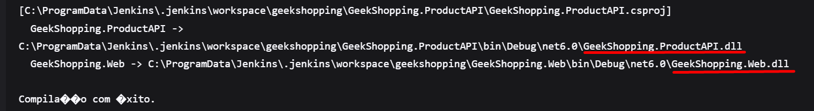

# Documentação do Projeto Final de DevOps - INFNET

Autor: Wanderson H. A. Leite

## Configurando uma aplicação no Kubernetes com Prometheus e Grafana

Nesta docs, está descrito os passos necessários para configurar uma aplicação .NET 6 no Kubernetes, utilizando o Prometheus e o Grafana para monitorar e visualizar métricas para implantação e monitoramento de uma aplicação customizada. Ademais, será realizado testes de stress e uma esteira de deploy da aplicação no Jenkins.

## Passo 1: Criando imagem da aplicação .NET 6

A imagem usada nesse projeto foi a `geekshoppingapi:v1`, que foi criada a partir do Dockerfile abaixo:

```dockerfile
FROM mcr.microsoft.com/dotnet/aspnet:6.0 AS base
WORKDIR /app
EXPOSE 80

FROM mcr.microsoft.com/dotnet/sdk:6.0 AS build
ARG BUILD_CONFIGURATION=Release
WORKDIR /src
COPY ["GeekShopping.ProductAPI/GeekShopping.ProductAPI.csproj", "GeekShopping.ProductAPI/"]
RUN dotnet restore "./GeekShopping.ProductAPI/./GeekShopping.ProductAPI.csproj"
COPY . .
WORKDIR "/src/GeekShopping.ProductAPI"
RUN dotnet build "./GeekShopping.ProductAPI.csproj" -c $BUILD_CONFIGURATION -o /app/build

FROM build AS publish
ARG BUILD_CONFIGURATION=Release
RUN dotnet publish "./GeekShopping.ProductAPI.csproj" -c $BUILD_CONFIGURATION -o /app/publish /p:UseAppHost=false

FROM base AS final
WORKDIR /app
COPY --from=publish /app/publish .
ENTRYPOINT ["dotnet", "GeekShopping.ProductAPI.dll"]
```

A imagem publicada no Docker Hub pode ser encontrada [aqui](https://hub.docker.com/r/wando777/geekshoppingapi).


O repositório da API da aplicação .NET 6 pode ser encontrado [aqui](https://github.com/wando777/microservices-dotnet6)

## Passo 2: Subindo a aplicação no Kubernetes

### Requisitos

- Utilize um Deployment para subir a aplicação com 4 réplicas.
- Crie uma probe (Readiness ou Liveness) para a aplicação.

  [Script de deploy da aplicação .NET](/scripts/geekshopping-deploy.yml):

  ```yaml
  apiVersion: apps/v1
  kind: Deployment
  metadata:
  name: geekshopping-deployment
  spec:
  replicas: 4
  selector:
    matchLabels:
      app: myapp
  template:
    metadata:
      labels:
        app: myapp
    spec:
      containers:
        - name: geekshopping
          image: geekshoppingapi:v1
          ports:
            - containerPort: 80
          livenessProbe:
            httpGet:
              path: /healthz
              port: 80
            initialDelaySeconds: 10
            periodSeconds: 30
  ```

- Exponha a aplicação de modo que ela fique acessível fora do Cluster utilizando o tipo de serviço NodePort.

  [Script de serviço NodePort](/scripts/geekshopping-svc.yml):

  ```yaml
  apiVersion: v1
  kind: Service
  metadata:
  name: geekshopping-service
  spec:
  type: NodePort
  selector:
    app: myapp
  ports:
    - protocol: TCP
      port: 80
      targetPort: 80
      nodePort: 30081
  ```

- Se a aplicação fizer uso de um banco de dados, crie um POD com o mesmo e deixe-o acessível através do ClusterIP.

  [Script de deploy do banco de dados](/scripts/mysql-deploy.yml):

  ```yaml
  apiVersion: apps/v1
  kind: Deployment
  metadata:
  name: mysql-deployment
  spec:
  replicas: 1
  selector:
    matchLabels:
      app: mysql
  template:
    metadata:
      labels:
        app: mysql
    spec:
      containers:
        - name: mysql
          image: mysql:latest
          ports:
            - containerPort: 3306
          env:
            - name: MYSQL_ROOT_PASSWORD
              value: senha
  ```

  [Script de serviço do banco do tipo ClusterIP](/scripts/mysql-svc-cip.yml):

  ```yaml
  apiVersion: v1
  kind: Service
  metadata:
  name: mysql-service
  spec:
  selector:
    app: mysql
  ports:
    - protocol: TCP
      port: 3306
      targetPort: 3306
  type: ClusterIP
  ```


## Passo 3: Configurando o Prometheus e o Grafana

Agora, vamos configurar o Prometheus e o Grafana para monitorar a aplicação.

- Aqui será necessário criar a estrutura para executar o Prometheus e o Grafana no Kubernetes. Você pode utilizar os seguintes arquivos YAML para definir os recursos necessários.

### Requisitos

- Certifique-se de que apenas o Grafana seja acessível fora do Cluster, utilizando um tipo de serviço LoadBalancer ou NodePort.

- Utilize um Persistent Volume Claim (PVC) para armazenar os dados do Prometheus de maneira persistente.

[Script de configuração do volume](/scripts/prometheus-pv.yml):

```yaml
apiVersion: v1
kind: PersistentVolume
metadata:
  name: prometheus-volume
  labels:
    type: local-pv
spec:
  capacity:
    storage: 1Gi
  volumeMode: Filesystem
  accessModes:
    - ReadWriteOnce
  persistentVolumeReclaimPolicy: Retain
  storageClassName: local-storage
  hostPath:
    path: /prometheus
```

[Script de configuração do PVC](/scripts/prometheus-pvc.yml):

```yaml
apiVersion: v1
kind: PersistentVolumeClaim
metadata:
  name: prometheus-pvc
  labels:
    type: local-pvc
spec:
  storageClassName: local-storage
  accessModes:
    - ReadWriteOnce
  resources:
    requests:
      storage: 1Gi
  selector:
    matchLabels:
      type: local-pv
```

[Script de configuração do Prometheus](/scripts/prometheus.yml):

```yaml
apiVersion: v1
kind: Service
metadata:
  name: prometheus-service
spec:
  selector:
    app: prometheus
  ports:
    - protocol: TCP
      port: 9090
      targetPort: 9090

---
apiVersion: v1
kind: ConfigMap
metadata:
  name: prometheus-config
data:
  prometheus.yml: |
    global:
      scrape_interval: 15s
    scrape_configs:
      - job_name: 'geekshopping'
        static_configs:
          - targets: ['geekshopping-service:80'] # IP do serviço da aplicação
      - job_name: 'prometheus'
        static_configs:
          - targets: ['localhost:9090']

---
apiVersion: apps/v1
kind: Deployment
metadata:
  name: prometheus-deployment
spec:
  replicas: 1
  selector:
    matchLabels:
      app: prometheus
  template:
    metadata:
      labels:
        app: prometheus
    spec:
      initContainers:
        - name: volume-permissions
          image: busybox
          command: ["sh", "-c", "chown -R 65534:65534 /prometheus"]
          volumeMounts:
            - name: prometheus-storage
              mountPath: /prometheus
      containers:
        - name: prometheus
          image: prom/prometheus:latest
          ports:
            - containerPort: 9090
          volumeMounts:
            - name: prometheus-config
              mountPath: /etc/prometheus/prometheus.yml
              subPath: prometheus.yml
            - name: prometheus-storage
              mountPath: /prometheus
      volumes:
        - name: prometheus-config
          configMap:
            name: prometheus-config
        - name: prometheus-storage
          persistentVolumeClaim:
            claimName: prometheus-pvc
```


[Script de configuração do Grafana](/scripts/grafana.yml):

```yaml
apiVersion: apps/v1
kind: Deployment
metadata:
  name: grafana-deployment
spec:
  replicas: 1
  selector:
    matchLabels:
      app: grafana
  template:
    metadata:
      labels:
        app: grafana
    spec:
      containers:
        - name: grafana
          image: grafana/grafana:latest
          ports:
            - containerPort: 3000

---
apiVersion: v1
kind: Service
metadata:
  name: grafana-service
spec:
  type: NodePort
  selector:
    app: grafana
  ports:
    - protocol: TCP
      port: 3000
      targetPort: 3000
```

- Criando dashboards no Grafana que exponham dados sensíveis da aplicação, como memória e CPU.

> .NET 6
> 
> ASPNET
> 

## Passo 4: Esteira de Deploy no Jenkins

- Esteira de deploy no Jenkins que faz o deploy da aplicação no Kubernetes.

**\*obs: Para essa etapa, apenas foi realizado o build da aplicação .NET 6 no Jenkins**.

### Requisitos

1. Instalação do [plugin do dotnet sdk.](https://plugins.jenkins.io/dotnet-sdk/)
2. Configurar o pipeline com o seguinte script:

```groovy
pipeline {
 agent any
 tools{
     dotnetsdk 'dotnet'
 }

 stages {
     stage('Initialize') {
         steps {
             echo 'Pipeline iniciado em:'
             bat 'echo %DATE%'
         }
     }
     stage('Git clone'){
         steps {
             echo 'Clonando repositório'
             git(url:'https://github.com/wando777/microservices-dotnet6.git', branch: 'main')
         }
     }
     stage('Build'){
         steps{
             dotnetClean(project: 'GeekShop.sln')
             dotnetBuild(project: 'GeekShop.sln')
         }
     }
 }
}
```

Build realizado com sucesso:



## Passo 5: Testes de Stress

- **Testes de stress na aplicação com JMetter graficamente apontando pro serviço da aplicação que possui uma porta externa para acesso via localhost.**

1. Primeiro teste: - 100 usuários - 1 segundos de ramp-up - 1000 iterações
   
   

2. Segundo teste: - 100 usuários - 10 segundos de ramp-up - 2000 iterações - 300ms Duration Assertion
   
   

- **Testes de stress na aplicação com JMetter via script no terminal dentro do cluster k8s apontando pro serviço da aplicação que possui uma porta interna para acesso do tipo ClusterIP.**

1. 25 usuários - 10 segundos de ramp-up - 1000 iterações - 300ms Duration Assertion
   

   [Dash com mais detalhes dos resultados do teste de stress](/scripts/stress-test/resultsdash/stress-test-result.html):
   

   Todos os dados do test estão na pasta [stress-test](/scripts/stress-test).
